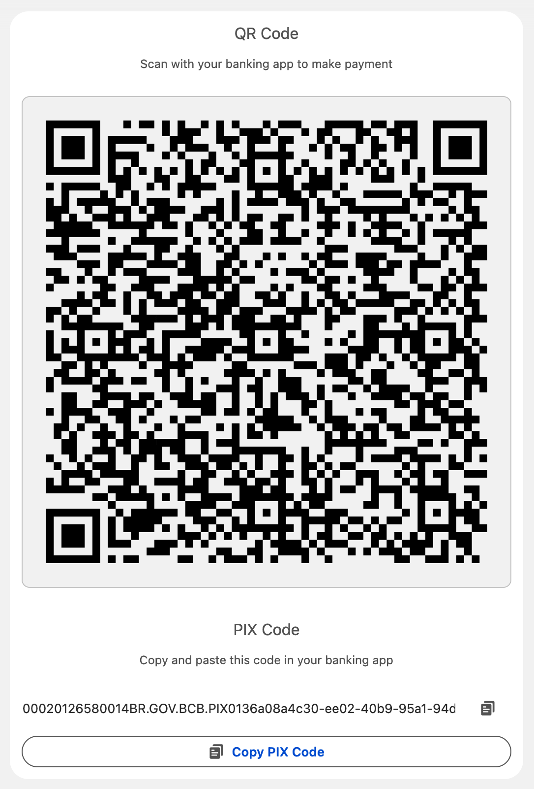

# Pix Code Generator and QR Code Display Component


This project provides a Lightning Web Component (LWC) that generates a PIX payment code and displays it as a QR code. It is designed for Salesforce environments and can be integrated into Salesforce applications.



> [!NOTE]
> Feel free to scan the code above and send me a small amount as a thank you. :)

## APIs

<!-- table -->

| API Name                            | Description                                                                                        |
| ----------------------------------- | -------------------------------------------------------------------------------------------------- |
| `pixCode`                           | The PIX code to be displayed.                                                                      |
| `paymentData`                       | An object containing payment details such as key, merchant name, city, amount, and transaction ID. |
| `size`                              | The size of the QR code (default is 200).                                                          |
| `showCode`                          | Boolean to toggle the display of the PIX code text (default is false).                             |
| `showQRCode`                        | Boolean to toggle the display of the QR code (default is false).                                   |
| `.copyPixCode()`                    | Method to copy the PIX code to the clipboard.                                                      |
| `.generatePixCodeFromPaymentData()` | Method to generate the PIX code from the provided payment data.                                    |

## Usage

To use it as a display only, generate the PIX code and pass it onto the `pixCode` attribute:

```html
<c-qr-code-display
  pix-code="{pixCode}"
  show-qr-code
  show-code
></c-qr-code-display>
```

To use it with payment data, pass a payment data object to the `paymentData` attribute:

```html
<c-qr-code-display
  payment-data="{paymentData}"
  show-qr-code
  show-code
></c-qr-code-display>
```

```javascript
import { LightningElement, track } from "lwc";
export default class ParentComponent extends LightningElement {
  @track paymentData = {
    key: "your-pix-key",
    merchantName: "Merchant Name",
    merchantCity: "City",
    amount: "100.00",
    transactionId: "1234567890"
  };
}
```

## Other libraries

`qr.min.js` is sourced from https://github.com/paulmillr/qr.
